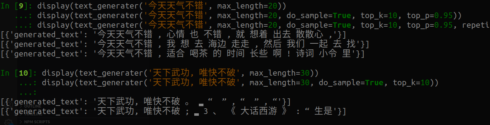

# CPM-TF2Transformer

CPM Fot Transformer

参考了 [qhduan/CPM-LM-TF2](https://github.com/qhduan/CPM-LM-TF2) 的转换代码, 转化成 `Transformer` 的 `TFGPT2LMHeadModel`

CPM 原REPO：https://github.com/TsinghuaAI/CPM-Generate

原项目首页：https://cpm.baai.ac.cn/


## 例子

初始化模型
```python
from transformers import XLNetTokenizer, TFGPT2LMHeadModel

tokenizer = XLNetTokenizer.from_pretrained('mymusise/CPM-Third-Party')
model = TFGPT2LMHeadModel.from_pretrained("mymusise/CPM-Third-Party")
```

文本生成
```python
from transformers import TextGenerationPipeline
text_generater = TextGenerationPipeline(model, tokenizer)

display(text_generater('今天天气不错', max_length=20))
display(text_generater('今天天气不错', max_length=20, do_sample=True, top_k=10, top_p=0.95))
display(text_generater('今天天气不错', max_length=20, do_sample=True, top_k=10, top_p=0.95, repetition_penalty=2))

display(text_generater('天下武功, 唯快不破', max_length=30))
display(text_generater('天下武功, 唯快不破', max_length=30, do_sample=True, top_k=10))
```

输出:


