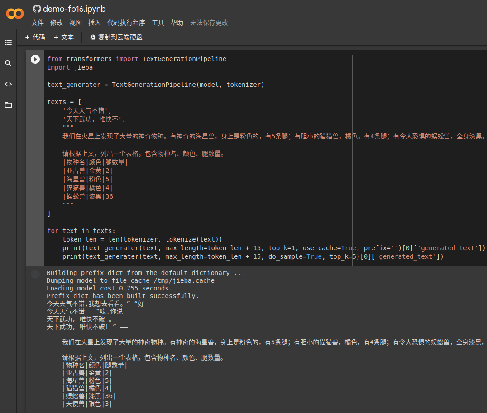

# CPM-TF2Transformer

CPM Fot Transformer

参考了 [qhduan/CPM-LM-TF2](https://github.com/qhduan/CPM-LM-TF2) 的转换代码, 转化成 `Transformer` 的 `TFGPT2LMHeadModel`

CPM 原REPO：https://github.com/TsinghuaAI/CPM-Generate

原项目首页：https://cpm.baai.ac.cn/


## 例子

依赖
```
pip install transformers
pip install jieba #因为原作者在做sentenceprice对文本进行了jieba分词
```

初始化模型
```python
from transformers import XLNetTokenizer, TFGPT2LMHeadModel

tokenizer = XLNetTokenizer.from_pretrained('mymusise/CPM-Third-Party')
model = TFGPT2LMHeadModel.from_pretrained("mymusise/CPM-Third-Party")
```

文本预处理(仿照原作的处理)
```python
def pre_text(t):
    translator = str.maketrans(" \n", "\u2582\u2583")
    seg_list = [x.translate(translator) for x in jieba.cut(t, cut_all=False)]
    new_seg = " ".join(seg_list)
    return new_seg

texts = [
    '今天天气不错',
    '天下武功, 唯快不破',
]
texts = [pre_text(text) for text in texts]
```


文本生成
```python
from transformers import TextGenerationPipeline
text_generater = TextGenerationPipeline(model, tokenizer)


def show(result):
    display(result[0]['generated_text'].replace('▂', ''))


for text in texts:
    show(text_generater(text, max_length=20 + len(text)))
    show(text_generater(text, max_length=20 + len(text), do_sample=True, top_k=10))
    show(text_generater(text, max_length=20 + len(text), do_sample=True, top_k=10, repetition_penalty=2))
```

输出:


